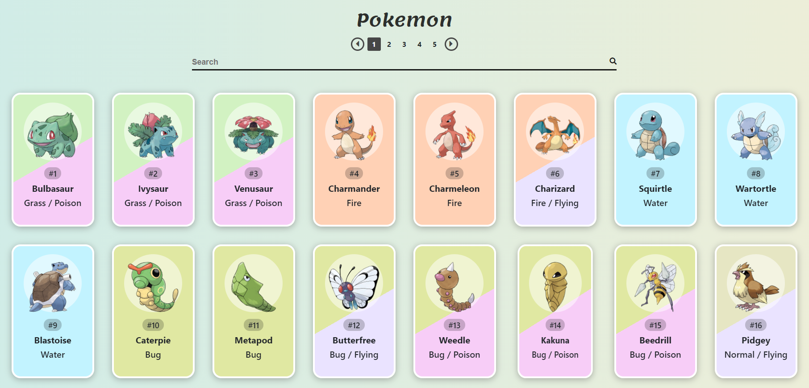
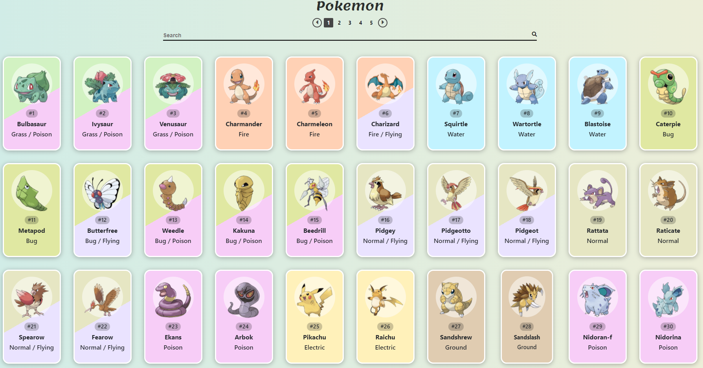

# Pokemon-JS-CSS-HTML

_It is an elegent web App that fetches Pokemon API and creates_
_New placeholders dynamically according the data received._

## Table of content

- Screenshots
- Usage
- Technologies used
- Requirements
- Installation
- Note
- Contributing
- License

## Screenshots

## Usage

Pokemon-JS-CSS-HTML can be used as backbone for a big
project that includes fetching APIs.

## Technologies used

- Javascript
- CSS
- HTML
- Fontawesome
- GoogleFonts

## Requirements

- Code Editor (i.e: VScode)
- Browser (i.e: Chrome)
- Stable internet Connection

## Installation

Running the Web App requires opening the index.html file\

## Note

Make sure to keep all the files together in a single folder\
or you have to change the src in the index.html file\

## Contributing

Pull requests are welcome. For major changes, please open\
 an issue first to discuss what you would like to change.

Please make sure to update tests as appropriate.

## License

[MIT](https://choosealicense.com/licenses/mit/)
